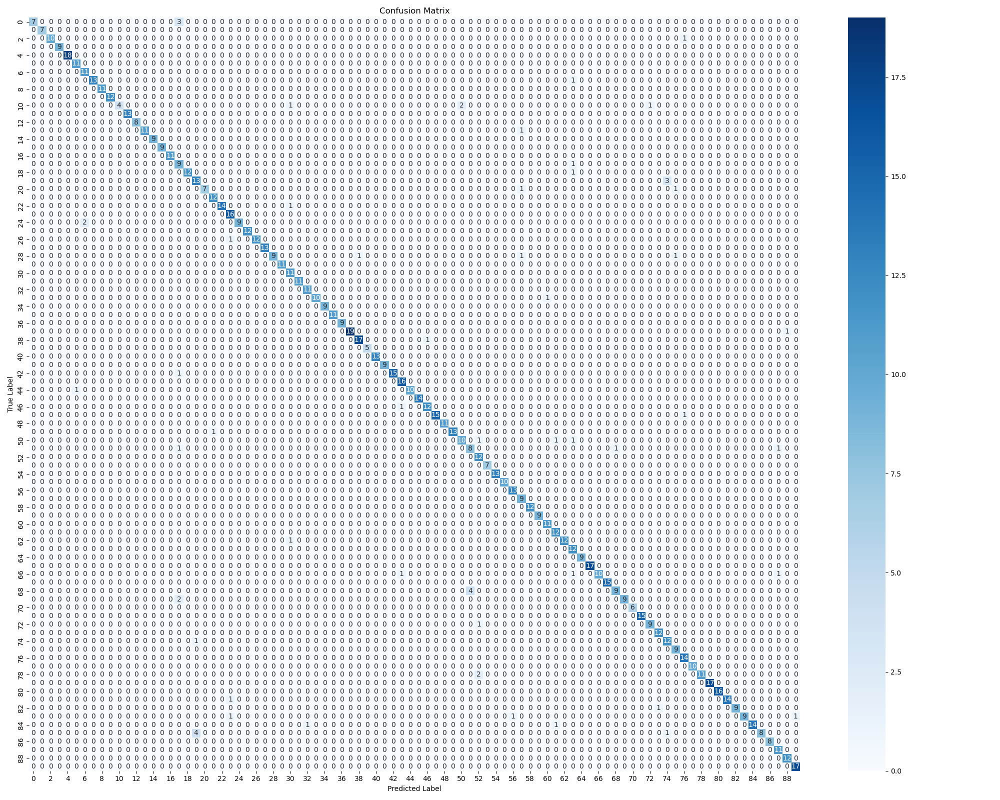

# Image Classification and Similarity Search

This repository contains an end-to-end pipeline for classifying animal images into one of 90 species and performing image similarity searches. The project leverages a deep convolutional neural network (ResNet-50) as a feature extractor, combined with a custom embedding layer and a final classification head. Additionally, it includes a frontend interface for users to upload an image and receive both a predicted class and visually similar images from the dataset.

## Overview

- **Model Architecture:**  
  - **Base Model:** ResNet-50 (pre-trained on ImageNet), with the final classification layer removed.
  - **Embedding Layer:** A dense layer of 256 neurons added after the ResNet-50 feature extractor.
  - **Classification Head:** A final dense layer with 90 neurons, each corresponding to one of the 90 animal classes.
  
- **Dataset:**  
  [Animal Image Dataset - 90 Different Animals](https://www.kaggle.com/datasets/iamsouravbanerjee/animal-image-dataset-90-different-animals)  
  This dataset covers a wide variety of animal species, ensuring a broad representation across 90 classes.

- **Training Details:**
  - **Learning Rate:** 0.01
  - **Epochs:** 10
  - **Batch Size:** 16
  - **Final Training Loss:** 0.2204

- **Performance Metrics:**
  - **Precision:** 0.9706
  - **Recall:** 0.9648
  - **F1-Score:** 0.9645

These metrics indicate strong classification performance on the dataset.

### Confusion Matrix

A confusion matrix (`confusion_matrix.png`) is included to visualize class-by-class performance.


## Image Similarity Search

In addition to classification, this solution provides an image similarity search feature:

1. **Feature Extraction:**  
   Each dataset image is passed through the model (ResNet-50 + embedding layer) to produce a 256-dimensional feature vector.

2. **Database Storage (SQLite):**  
   All 256-dimensional feature vectors are stored in an SQLite database.

3. **Similarity Query:**  
   When a new image is uploaded, its embedding is computed, and the database is queried to find the most similar images based on vector similarity.

This enables you to not only predict the class of an uploaded image but also retrieve visually similar images from the existing dataset.

## Frontend Interface

A simple frontend is included to facilitate interaction:

1. **Upload an Image:** You provide an image of an animal.
2. **Get Predicted Class:** The system returns the predicted class if it matches one of the 90 known classes.
3. **View Similar Images:** The interface displays the top similar images from the dataset, allowing you to explore visually related samples.

## Repository Structure
```bash
.
├── requirements.txt          # Python dependencies
├── README.md                 # This README file
├── .gitignore                # Git ignore file 
├── LICENSE                   # License file for the project                 
├── main.py                   # Entry point for the Flask application
├── model.py                  # Model definition, loading, and inference utilities 
├── similarity.py             # Functions for similarity search and confusion matrix creation
└── train.py                  # Training script for the model
├── templates/
│   ├── index.html            # Frontend template
└── confusion_matrix.png      # Confusion matrix visualization
```


## Getting Started
1. Clone the Repository:
```bash
   git clone https://github.com/git-khandelwal/image-similarity
   cd image-similarity
   ```

2. Install Dependencies:
```bash
   pip install -r requirements.txt
   ```

3. Download and Prepare Dataset:
   - Download from Kaggle:
     https://www.kaggle.com/datasets/iamsouravbanerjee/animal-image-dataset-90-different-animals
   - Extract into base directory.

4. Model Training:
   To retrain the model and create feature vector db:
```bash
   python train.py
   ```

5. Run the Flask Application:
```bash
   python main.py
   ```
   

6. Use the Application:
   - Access the app at http://localhost:5000
   - Upload an image through the provided form.
   - View the predicted class and similar images.

## Future Improvements
- Indexing Techniques:
  Consider using vector databases like Faiss for faster, more scalable 
  similarity searches.
  
## References
- K. He, X. Zhang, S. Ren, and J. Sun, "Deep Residual Learning for Image Recognition," in *Proceedings of the IEEE Conference on Computer Vision and Pattern Recognition (CVPR)*, 2016. [Paper Link](https://arxiv.org/abs/1512.03385)

 ## License
 This project is licensed under the MIT License.
